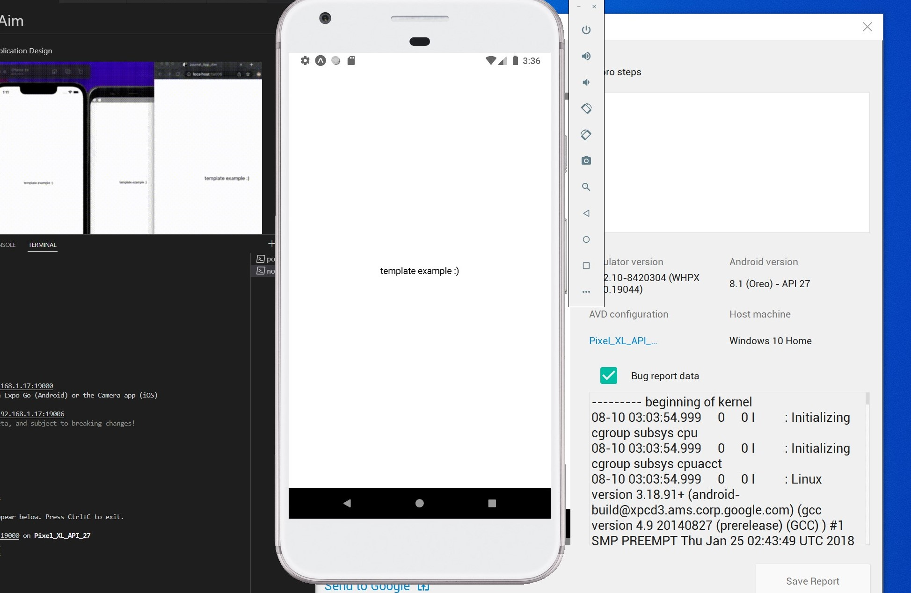

# Journal_App_Aim
My Journal App - Small Application Design




### ios:
- `npx pod-install`
 - https://reactnative.dev/docs/running-on-device

### android:
- `./gradlew <your cmd here>`
  - https://reactnative.dev/docs/running-on-device

```
BUILD SUCCESSFUL in 6m 17s
```
## How to run:
Start: `npm run start` (pre-builds deps)

 ### Run the following (ios devices):

- `npm run rn-start` (Runs both iOS and Android devices)

<br>OR</br>

- `npm run web` (scan code to device with expo go app or run with an emulator)
    - expo workflow.

### Run the following (windows devices):
 - `npm install -g win-node-env`
 - `npm run web` (scan code to device with expo go app or run with an emulator)
   
## How to build:
- `expo build:ios`
- `expo build:web`
- `expo build:android` 

## Resources/Extras (Manuals):
- `expo start --help`
- `expo`
- `yarn react-native`


## **<u>Please, Read the directions when prompted. </u>**
### windows branch (android studios):
https://github.com/aimeelramirez/Journal_App_Aim/tree/init/windows
### ios branch (xcode):
https://github.com/aimeelramirez/Journal_App_Aim/tree/initial/install

